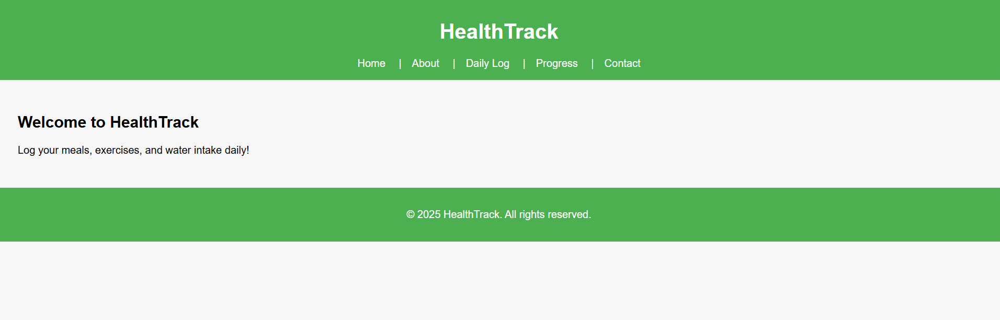
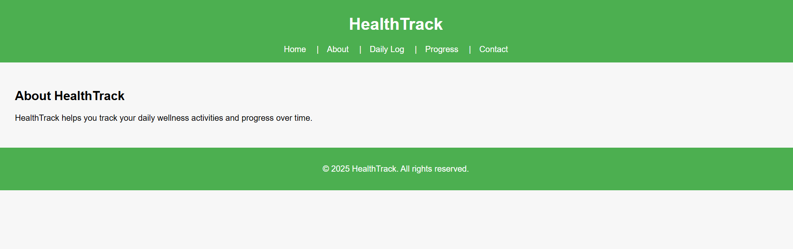
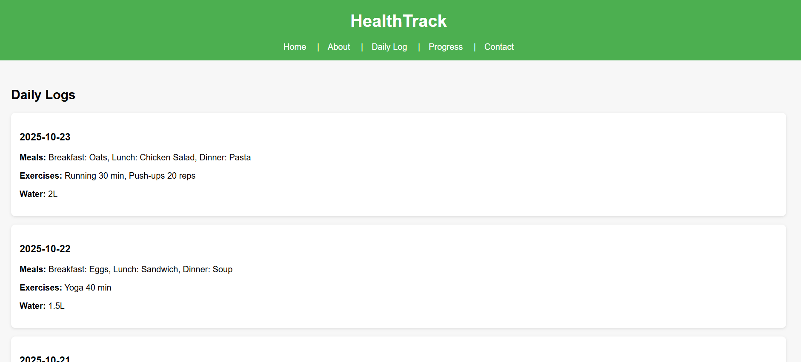
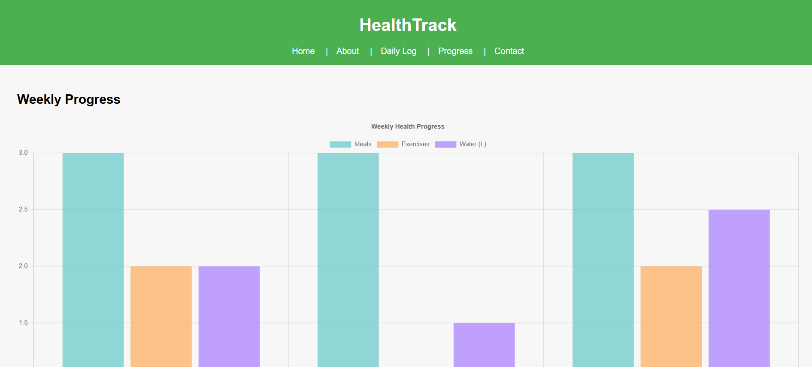
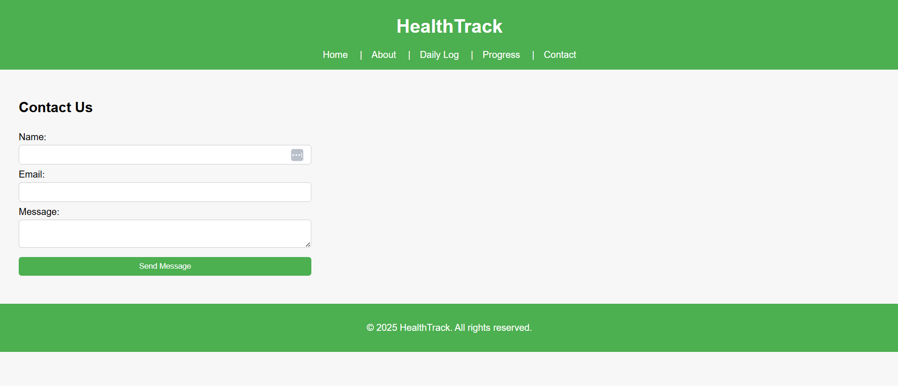

HealthTrack

Description:
HealthTrack is a frontend web application that helps users log daily meals, exercises, and water intake. Users can view daily logs, see detailed entries for each day, and track their weekly progress with interactive charts.

Technologies Used:

React.js

React Router DOM

Chart.js + react-chartjs-2

CSS

Pages and Features

Home: Welcome page with app overview.

About: Information about HealthTrack.

Daily Log: List of daily logs with clickable cards.

Daily Log Detail: Dynamic page for each day’s detailed entries.

Progress: Weekly summary with charts for meals, exercises, and water intake.

Contact: Contact information or feedback form placeholder.

## Setup Instructions

1. Clone the repository:
   git clone https://github.com/SakoA10/healthtrack.git

2. Go inside the project folder:
   cd healthtrack

3. Install dependencies:
   npm install

4. Start the development server:
   npm start

5. Open your browser and go to:
   http://localhost:3000

## Screenshots

### Home Page

### About Page

### Daily Log Page

### Progress Page

### Contact Page

## Backend (Phase 2)

### Backend Tech

- Node.js + Express
- MySQL (phpMyAdmin)
- JWT Authentication (Signup/Login)
- CRUD API for Logs

### Backend Setup

1. Go to backend folder:
   cd server

2. Install dependencies:
   npm install

3. Create a `.env` file inside `server/`:
   PORT=5000
   JWT_SECRET=your_secret_here
   DB_HOST=localhost
   DB_USER=root
   DB_PASSWORD=
   DB_NAME=healthtrack_db

4. Run the backend:
   npm run dev

### API Endpoints

- POST /api/auth/signup
- POST /api/auth/login
- POST /api/logs (protected)
- GET /api/logs (protected)
- GET /api/logs/:date (protected)
- PUT /api/logs/:date (protected)
- DELETE /api/logs/:date (protected)
